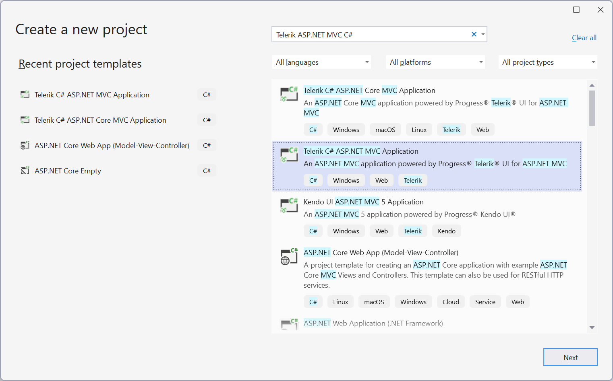

# Starting in {{ site.product }} with a Project Template

Welcome to the Getting Started with Progress<sup>®</sup> Telerik<sup>®</sup> UI for ASP.NET MVC in Visual Studio tutorial!

The fastest way to start with Telerik UI is with a project template, but you can also manually [add the Telerik controls to an existing application](). 

This tutorial guides you through implementing the Telerik UI for ASP.NET MVC Grid and Datepicker in a new application. To create the application, you will use the project template provided by the [Visual Studio Extensions]() that come with the Telerik UI for ASP.NET MVC installation.

The Telerik extensions streamline the Telerik UI for ASP.NET MVC setup by automatically adding the necessary references and configuration. These extensions also provide a wizard that can [configure an existing ASP.NET MVC application]() for the Telerik controls.

Other popular approaches for starting with Telerik UI for ASP.NET MVC include:

* [Setup with Telerik NuGet]()&mdash;this method allows you to download the Telerik controls by using the NuGet package manager in Visual Studio.
* [Manual setup with local files]()&mdash;with this method, you add the `Kendo.Mvc.dll` assembly to your project by using local files. This assembly enables you to use the Telerik UI components. 

>tip How about a free Telerik UI onboarding course? Check out the [Video Onboarding]() article and learn how to take advantage of the <a href="https://www.telerik.com/support/video-courses" target="_blank">Telerik and Kendo UI Video Courses</a>.

## Prerequisites

* Telerik UI for ASP.NET MVC requires the <a href="https://dotnet.microsoft.com/download/dotnet-framework" target="_blank">.NET Framework</a>.

* [Visual Studio](https://www.visualstudio.com/downloads/) 2019, 2022, or later.
* [Telerik account](https://www.telerik.com/account).

## Downloading and Installing

Follow these steps to download and install Telerik UI for ASP.NET MVC:

1. Log in to your [Telerik account](https://www.telerik.com/login/v2/telerik).

   >tip If you don't have a Telerik account yet, you can [create one for free]().

1. Download the installation file:

    * To get the free trial version, follow [this link](https://www.telerik.com/try/ui-for-asp.net-mvc) to download UI for ASP.NET MVC. The installer will activate your trial when you complete the installation.

    * If you have already purchased a license:

        1. Click **Downloads** in the top navigation bar of your [Telerik account](https://www.telerik.com/login/v2/telerik).

        1. Click **UI for ASP.NET MVC**.

        1. Download the `.msi` installer file from the **Installation** section.

1. Close any running Visual Studio instances and run the Telerik UI for ASP.NET MVC installer. The automatic setup will guide you through the rest of the installation. The Telerik Visual Studio Extensions are installed by default.

The default installation folder is `C:\Program Files (x86)\Progress\Telerik UI for ASP.NET MVC<version>`. 

## Creating a Telerik ASP.NET MVC Application

After the Visual Studio Extensions are installed, create a Telerik ASP.NET MVC application by using the **Create New Project** wizard in Visual Studio.

1. In the Visual Studio toolbar, click **File** > **New** > **Project**.     

1. Search for and select the **Telerik ASP.NET MVC C#** project template. Click **Next**.

	

1. Configure the project. Click **Create**.

    

1. Select the **GRID AND MENU** template. Click **Next**.

   For more information on the additional predefined Telerik template options, refer to the [Creating New Projects]() article. 

	

1. Choose a [Theme](https://docs.telerik.com/kendo-ui/styles-and-layout/sass-themes/overview#using-the-build-process-of-the-themes). Click **Finish**.


The newly created application already has a reference to the required `Kendo.Mvc.dll` assembly. The wizard also references the client-side resources (the Kendo UI script and theme-related CSS files) in the `_Layout.cshtml`. 

You can now start adding components.

* [Find more information about Creating new Telerik Projects in this article.](https://docs.telerik.com/aspnet-mvc/vs-integration/new-project-wizard)

## Adding Components to the Application

As a result of selecting the **GRID AND MENU** template, a Grid component has been added to the `Index.cshtml` view, and a Menu to the `_Layout.cshtml`. The Grid is configured and bound remotely to sample data returned by the `GridController`. The next step is to add an additional component to the application.

Add a DatePicker to the `Index.cshtml` view:

```Razor
    <h4>Telerik UI for ASP.NET MVC DatePicker:</h4>

    @(Html.Kendo().DatePicker()
        .Name("datepicker") // The Name of the DatePicker is mandatory. It specifies the "id" attribute of the component.
        .Value(DateTime.Today) // Sets the value of the DatePicker.
    )
```

## Building and Running the Application 

Press `CTRL+F5` to build and run the application. You have a Grid and a DatePicker on your page.


## Adding Your License File

Using any client-side assets from the [Kendo UI CDN]() or the [@progress/kendo-ui NPM package](https://www.npmjs.com/package/@progress/kendo-ui) requires you to add a Telerik license file to your application. A missing license file triggers [a banner, a watermark, and causes a warning message]() in the browser's console.

To generate your license file and add it to your application, follow the instructions in the [Installing a License File]().

## Next Steps

* [Explore the Telerik UI for ASP.NET MVC fundamentals]()
* [Grid Data Binding Overview]()
* [Integrate Telerik UI for ASP.NET MVC in Visual Studio]()

## See Also

* [Exploring the Helper Script Dependencies]()
* [Integrate Telerik UI for ASP.NET MVC in Visual Studio]()
* [Upgrade Telerik UI for ASP.NET MVC]()
* [Collected Examples on ASP.NET MVC](https://github.com/telerik/kendo-examples-asp-net-mvc)
* [Collected Examples on Telerik UI for ASP.NET MVC](https://github.com/telerik/ui-for-aspnet-mvc-examples)
* [Migrating from MVC to Core MVC](https://docs.telerik.com/aspnet-core/installation/migrating)
* [MS - Upgrade from ASP.NET Framework to ASP.NET Core](https://learn.microsoft.com/en-us/aspnet/core/migration/proper-to-2x/?view=aspnetcore-7.0)
