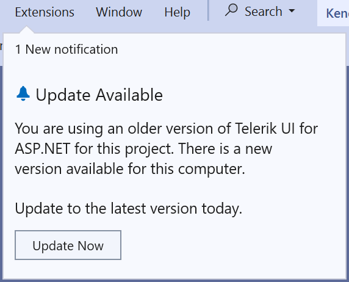
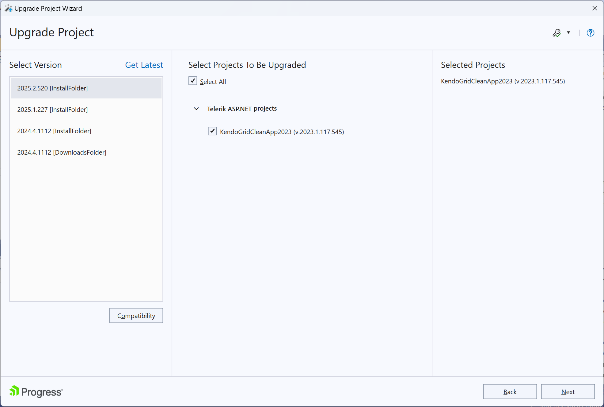
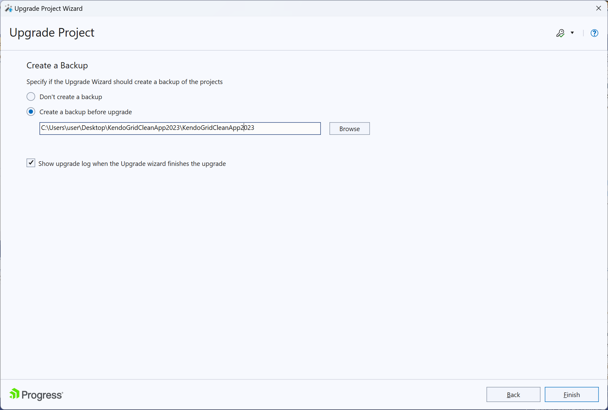

# Upgrading {{ site.product }}

This document describes how to upgrade the version of the {{ site.product }} helpers.

## Upgrading to New Versions

To update {{ site.product }} to a new version, either:


* [Upgrade with NuGet or Bower](#using-nuget-or-bower).

* [Use the Upgrade Project Wizard](#using-the-upgrade-project-wizard).

* [Manually replace the references and files](#upgrading-manually).



### Using NuGet or Bower

To upgrade the version with NuGet or Bower:

1. In Visual Studio, open the NuGet Package Manager and navigate to the **Installed** tab. Click **Update** for the **Telerik.UI.for.AspNet.Core** package.
   * If you use Bower instead of NuGet, open the Bower Package Manager and select the **Installed** tab. Click **Update** for the **kendo-ui** package.
1. In the application, manually replace any references which point to the old Kendo UI [scripts and styles]().

   * If the scripts and styles are referenced through the Kendo CDN service, update the links with the new version.

      ```HTML _Layout.cshtml
      <link rel="stylesheet" href="https://kendo.cdn.telerik.com/themes/{{ site.themesCdnVersion }}/default/default-main.css" />
      <script src="https://code.jquery.com/jquery-3.7.0.min.js"></script>
      <script src="https://kendo.cdn.telerik.com/{{ site.mvcCoreVersion }}/js/kendo.all.min.js"></script>
      <script src="https://kendo.cdn.telerik.com/{{ site.mvcCoreVersion }}/js/kendo.aspnetmvc.min.js"></script>
      ```

   * If the scripts and styles are referenced locally, download the JavaScript and CSS files from the Telerik website and then copying them in your project. For the detailed step-by-step procedure, refer to the [Using Local Files]() article.


> To properly load the Telerik and Kendo UI packages, both [NuGet]() and [Bower](https://docs.telerik.com/kendo-ui/intro/installation/bower-install#kendo-ui-professional) require authentication.



### Using the Upgrade Project Wizard

To upgrade your project by using the **Upgrade Project Wizard**, follow these steps:

1. Open the **Extensions->Telerik Menu** or click the **Update Now** button as in the screenshot below to start the upgrading process.

    
1. Select the files that must be included in the update process and click **Next**.

    
1. Choose the project or projects you want to upgrade.

    
1. Pick an option for the **EditorTemplates** folder.

    
1. Create a backup.

    
1. Be careful not to overwrite any existing customized editor templates.

    

The project will be upgraded to the latest {{ site.product }} version.





### Upgrading Manually

1. [Download](#getting-the-binaries) the desired version from the **Download** section of your account.
1. Change the reference to the new `Kendo.MVC` dll. Verify that the dll refers to the correct ASP.NET Core version.
1. In the application, manually replace any references which point to the old Kendo UI [scripts and styles]().

   * If the scripts and styles are referenced through the Kendo CDN service, update the links with the new version.

      ```HTML _Layout.cshtml
      <link rel="stylesheet" href="https://kendo.cdn.telerik.com/themes/{{ site.themesCdnVersion }}/default/default-main.css" />
      <script src="https://code.jquery.com/jquery-3.7.0.min.js"></script>
      <script src="https://kendo.cdn.telerik.com/{{ site.mvcCoreVersion }}/js/kendo.all.min.js"></script>
      <script src="https://kendo.cdn.telerik.com/{{ site.mvcCoreVersion }}/js/kendo.aspnetmvc.min.js"></script>
      ```

   * If the scripts and styles are referenced locally, download the JavaScript and CSS files from the Telerik website and then copying them in your project. For the detailed step-by-step procedure, refer to the [Using Local Files]() article.

> The `NuGet package` and the required [`client-side resources`]() must have identical versions.




### Upgrading Manually

1. Replace all scripts, styles, and images that are related to Telerik UI for ASP.NET MVC with the desired version of the framework.
1. Download the desired version from the [UI for ASP.NET MVC download page](https://www.telerik.com/account/product-download?product=KENDOUIMVC).
1. In the application, manually replace any references that point to the old Kendo UI [scripts and styles]().

   * If the scripts and styles are referenced through the Kendo UI CDN service, update the links with the new version.

      ```HTML _Layout.cshtml
      <link rel="stylesheet" href="https://kendo.cdn.telerik.com/themes/{{ site.themesCdnVersion }}/default/default-main.css" />
      <script src="https://code.jquery.com/jquery-3.7.0.min.js"></script>
      <script src="https://kendo.cdn.telerik.com/{{ site.mvcCoreVersion }}/js/kendo.all.min.js"></script>
      <script src="https://kendo.cdn.telerik.com/{{ site.mvcCoreVersion }}/js/kendo.aspnetmvc.min.js"></script>
      ```

   * If the scripts and styles are referenced locally, download the JavaScript and CSS files from the Telerik website and then copying them in your project. For the detailed step-by-step procedure, refer to the [Using Local Files]() article.

> The `Kendo.Mvc.dll` and the required [`client-side resources`]() must have identical versions.


## Switching to a Developer License [Deprecated]

> Starting with version 2025 Q3, the Trial package is deprecated, and the toolset is available only with a Developer License.

1. After the purchase of a Developer License, follow the [Update your license key](#license-key-updates) guidelines.
1. To upgrade to the latest product version, follow the steps for [updating the {{ site.product }} version](#upgrading-to-new-versions).


If you still see the Trial message after you switch to a developer (commercial) license, check the [troubleshooting knowledge base article]().


## See Also

* [Upgrade Troubleshooting]()

* [Telerik UI for ASP.NET Core Download and Installation]()
* [Downloading New Versions of Telerik UI for ASP.NET Core](https://www.telerik.com/aspnet-core-ui/documentation/vs-integration/latest-version-retrieval).

* [Upgrading Telerik UI for ASP.NET MVC Projects](https://www.telerik.com/aspnet-mvc/documentation/vs-integration/upgrade-wizard).

